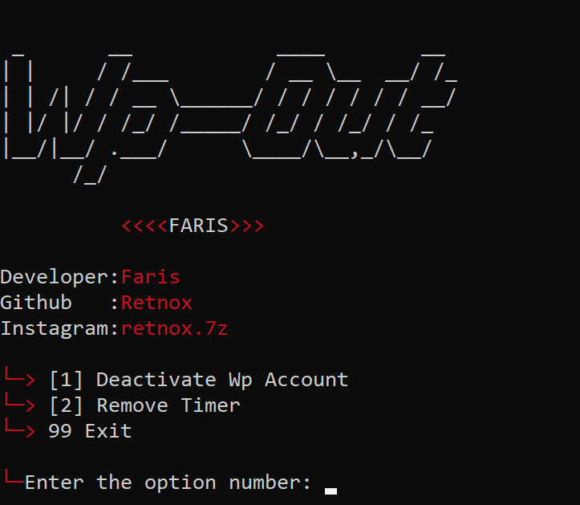

 
  

# Wp-Out

This is deactivate which can deactivate unlimitedly number wp only. Many times you just want to annoy or play a prank on your friends. You can deactivate unlimited anyone Wp. this tool made by @retnox

* `Wp-Out Features Lock Any Number with one click.

* `Instant delivery 10s delay.

* `Deactivate & RemoveTimer.

* `No missing issues, all number will be locked once.

* `For Password Contact Instagram : retnox.7z

* `All country.

-Update script when i will update repository.

- Support

> termux and all linux os windows.etc..

  
 
- Installation & Step's 

> `apt update && apt upgrade`

> `git clone https://github.com/Retnox/Wp-Out.git`

> `cd Wp-Out`

> `python3 Run.py`

> `Use daily script command`

> `cd Wp-Out`

> `python3 server.py`
  

Note : Whenever you want to run script of whatsapp Out after setup use this code to direct run the script 

After Server gets Started ....

> `cd Wp-Out`

> `python3 main.py`

This tool will not work now still server not connected
